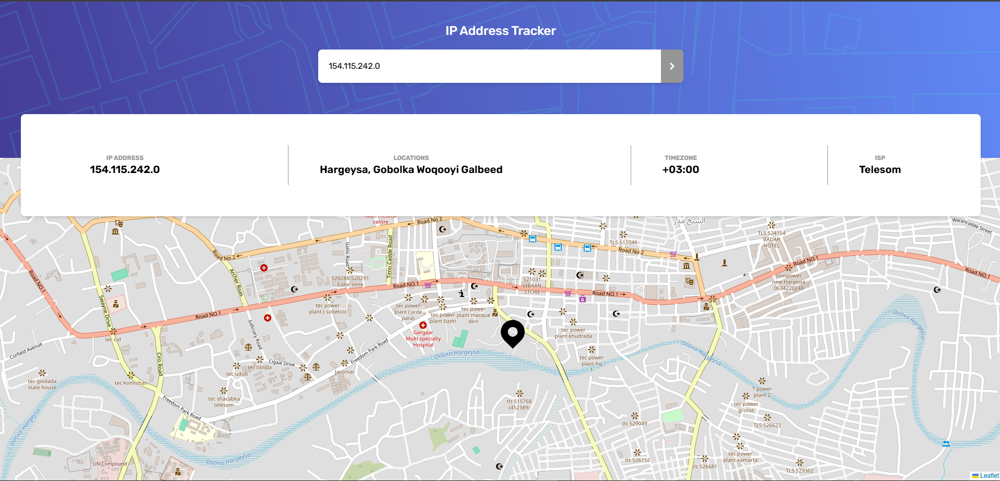

# 🛰️ IP Address Tracker

A modern, responsive IP Address Tracker built with **React (Vite)**, **Leaflet**, **Zustand**, and **Tailwind CSS**, powered by the [IPify Geolocation API](https://geo.ipify.org/).  
It displays detailed IP information including **IP address**, **location**, **timezone**, **ISP**, and shows the user's location on an interactive map.

👉[Live Preview](https://ip-tracker-app-alpha.vercel.app/)



---

## 🔍 Features

- 📍 Search any IPv4 or domain
- 🗺️ View precise location on a Leaflet-powered map
- 🕒 Timezone detection
- 🌐 ISP provider details
- ⚡ Built with fast and modern tools (Vite, Zustand, TailwindCSS)
- 🌙 Responsive design with dark/light mode toggle (optional if you added this)

---

## 🛠️ Tech Stack

| Tool                                         | Description                                                         |
| -------------------------------------------- | ------------------------------------------------------------------- |
| [React (Vite)](https://vitejs.dev/)          | Lightning-fast front-end framework                                  |
| [Leaflet](https://leafletjs.com/)            | Open-source JavaScript library for mobile-friendly interactive maps |
| [Zustand](https://github.com/pmndrs/zustand) | Simple state management for React                                   |
| [Tailwind CSS](https://tailwindcss.com/)     | Utility-first CSS framework                                         |
| [IPify Geo API](https://geo.ipify.org/)      | IP Geolocation API used to fetch IP location data                   |

---

## 🚀 Getting Started

### 1. Clone the Repository

```bash
git clone https://github.com/your-username/ip-tracker-app.git
cd ip-tracker-app
```
